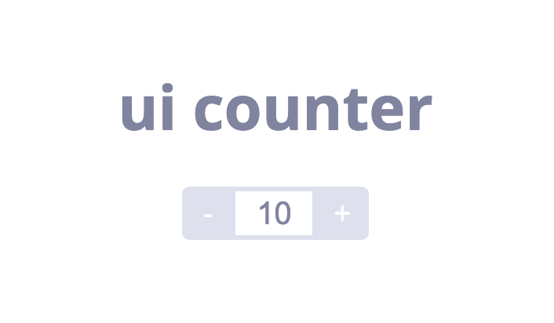

<br/>
<br/>

<p align="middle" >
  
</p>
<h2 align="middle">UI Counter</h2>
<p align="middle">Cypress를 익혀보기 위한 초간단 미션</p>
<p align="middle">
  
  
  
  
  
</p>

## 🔥 Projects!

<p align="middle">
  
</p>

counter라는 간단한 미션을 통해서 Cypress라는 E2E 도구에 익숙해져보세요. 아래의 간단한 기능을 구현하면 쉽게 Cypress도구를 사용해보실 수 있습니다.

- [ ] 생성시 버튼과 초기값(10)을 렌더링 한다.
- [ ] `+` 버튼을 클릭 시 count가 1증가한다.
- [ ] `-` 버튼을 클릭 시 count가 1감소한다.
- [ ] `+` 버튼을 눌렀을 때 count가 12가 넘는 경우 더이상 증가하지 못한다. (Max 값이 12)
- [ ] `-` 버튼을 눌렀을 때 count는 8보다 작아지는 경우 감소하지 못한다. (Min 값이 8)

# 🌡️ 실습: Cypress 설치 및 사용

```light
yarn install or npm install
cypress open
```

## 결과 확인


## 실행 화면


## 액션 로그


<br>

# 🚀 로컬서버 띄우기

cypress는 실제 유저가 페이지에 접속해서 동작하는 것처럼 테스트하는 도구입니다.
따라서 실제 접속할 페이지가 존재하게끔 아래 순서를 따라 로컬서버를 띄워주세요.

## 1. 의존성 모듈 설치

```shell
yarn global add http-server
npm install -g http-server
```

## 2. 서버 띄우기

```shell
http-server . -p 8000
```

터미널 창의 Available on의 주소로 접속하면 결과를 확인할 수 있습니다. 😀

<br>

## 🚨 Error

### 1. 환경변수 문제

의존성 모듈을 전역 설치했음에도 불구하고, 'http-server'를 인식할 수 없다는 에러가 발생한다면 아래의 순서를 따라 환경변수를 편집 해주세요.

```shell
yarn global bin
npm bin -g
```

전역 설치된 패키지의 path를 복사한 뒤, 아래의 순서를 따라 환경변수를 추가해주세요.

`window 검색 => 시스템 환경 변수 편집 => 환경 변수 => 시스템변수 => Path => 새로 만들기 => 위에서 복사한 path 붙여넣기 후 저장`

<br>

### 2. 새로고침과 캐싱 문제 해결 방법

코드의 변경사항이 http-server에 적용되지 않는 경우가 있습니다. 개발자 도구를 연 상태로 `ctrl + shift + r`을 눌러서 새로고침을 해주세요. 😀

<br>

## 👏 Contributing

만약 미션 수행 중에 개선사항이 보인다면, 언제든 자유롭게 PR을 보내주세요.

<br>

## 🐞 Bug Report

버그를 발견한다면, [Issues](https://github.com/imakerjun/cypress-basic/issues)에 등록해주세요.

<br>

## 📝 License

This project is [MIT](https://github.com/imakerjun/cypress-basic/blob/master/LICENSE) licensed.
